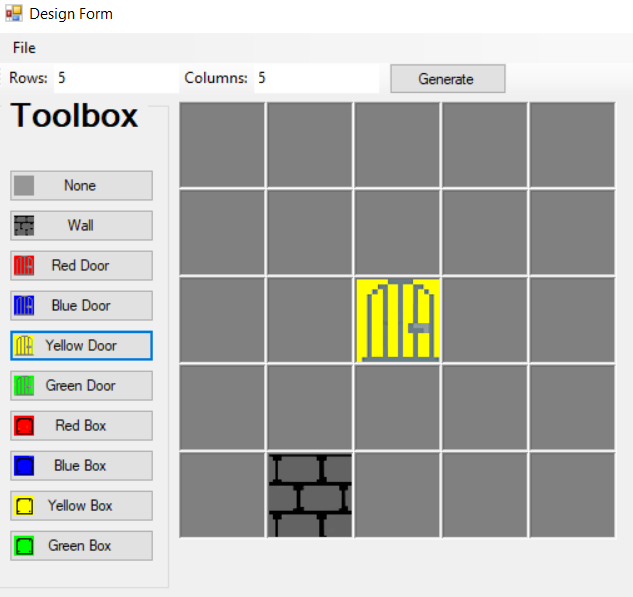
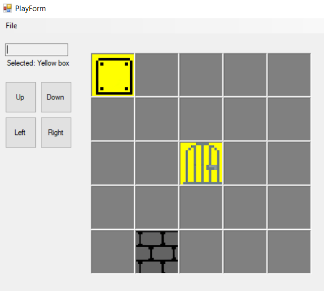

# QGame
Block puzzle game made with Windows Forms.

You can design and save block-pushing puzzles.

Type the desired amount of rows and columns, then click "Generate".
Select an object to place in the grid by clicking the desired object and then click on the grid where you want it to go.

You can play the levels you or your friends designed.

Click on the box to select it. Click on the direction buttons to move it in a direction.

The exe is in the bin/debug folder. Pre-existing saved levels are also in the bin/debug folder.
